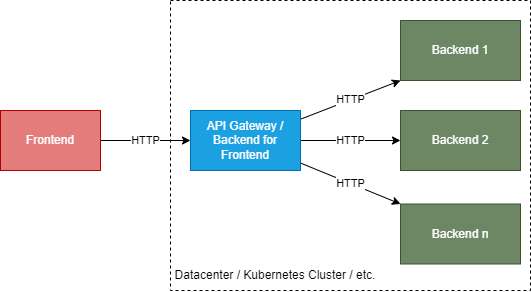

# Fancy.ResourceLinker
A library to easily create API Gateways and Backend for Frontends (BFF) based on ASP.NET Core.

## Why an api Gateway/Backend for Frontend
If you need to access multiple backend systems from a single frontend, then it is often better the frontend has a 
single system it communicates with and which is also located closer to the backend systems instead of letting the frontend 
communicate with each single backend directly. The following picture depicts this connstellation.



The advantages you get if you use the API Gateway or Backend for Frontend pattern are:

- **Loose Coupling**
  - The host urls, routes and api endpoints of the backend system can be changed independently of the client. If there are breaking
    changes, they can be compensated within the API Gateway.
- **Enhanced Performance**
  - If you need to call multiple backend systems to fill a single view in your frontend, this task can usually be performed faster and 
    more efficiently on server systems. Furthermore, the API Gateway is closer to the backend and therefore it has a smaller latency.
  - If there is data which does not need to be retrieved with each request, you can easily cache data within the API Gateway which 
    makes responses faster and saves load on backend.
  - If your API Gateway knows about each single view of your frontend, then we talk about a Backend for Frontend. A Backend for Frontend
    can create optimized responses for your frontend. The goal is that a frontend makes one request per view to initially fill a view. 
    This saves payload on the route from frontend to gateway which has typically a smaller bandwidth.
- **Improved Security**
  - If you publis all api endpoints of all backends in one api gateway, you have them availalbe under the same orign. Your backends systems
    are not available directly which and you have only one point left where you have to care about security. 
  - You can run OAuth authorization flows server side at the API Gateway which means that tokens are also available only on server side. 
    Handling tokens on the client side is not recommended or even allowed by the security standards. Shifting this to server side makes 
    your application more secure.

## Features
With Fancy Resource Linker you can easily add the following features to your API Gateway: 

- **Data Aggregation** 

  Aggregate data from different sources (e.g. different Microservices) into view models which are optimized for your client. Reduce the calls of the client to the backend by filling an entire view in your client with a single request and thus boosting your client side user experience.

- **Data Caching**
  
  Cache data you received from backend system within your API Gateway to make following requests faster and save load on the backend
  system.

- **Reverse Proxy**
  
  Publish separate deployed Apps or Microfrontends or Microservices under one orign within different virtual directories.

- **Truly RESTful APIs utilizing HATEOAS**

  Create web api's which enrich your json documents with metadata about connected/linked resources and with possible actions which can be executed on your data to create a full self describing api by the use of hypermedia.

- **Authentication Gateway**
  
  Let your gateway act as a single authentication facade to all of your resources behind, running OAuth flows server side and keeping tokens also only server side to obtain the maximum security and comply to all current security standards.

## Sample Application
There is a sample application [Fancy.ResourceLinker-Sample](https://github.com/fancyDevelopment/Fancy.ResourceLinker-Sample) which demonstrates all the features of this library. Have a look to it to see how the individual fetures can be used.

## Getting Started

First add the [Fancy.ResourceLinker.Gateway](https://www.nuget.org/packages/Fancy.ResourceLinker.Gateway) nuget package to your project.

To get started building an api gateway with Fancy.ResourceLinker in your ASP.NET Core application add the required services to the service collection and load a configuration by providing a configuration section.

```cs
var builder = WebApplication.CreateBuilder(args);

builder.Services.AddGateway()
                .LoadConfiguration(builder.Configuration.GetSection("Gateway"))
                .AddRouting();
```

In your application add a configuration section with the name `"Gateway"` and create the default structure within it as shown in the following sample snippet:

```json
"Gateway": {
  "Routing": {
    "Routes": {
      "Microservice1": {
        "BaseUrl": "http://localhost:5000",
      }
    }
  }
}
```

Finally you can ask for a type called `GatewayRouter` via dependency injection and use it to make calls to your microservices/backends using the name of your route in the configuration and a relative path to the data you would like to retrieve.

```cs
[ApiController]
public class HomeController : HypermediaController
{
    private readonly GatewayRouter _router;

    public HomeController(GatewayRouter router)
    {
        _router = router;
    }

    [HttpGet]
    [Route("api/views/home")]
    public async Task<IActionResult> GetHomeViewModel()
    {
        var dataFromMicroservice = _router.GetAsync<TypeToDeserializeData>("Microservice1", "api/data/123");
        [...]
    }
}
```

With this basic set up you can make calls to your microservices easily and change the base address in the configuration. Read through the advanced features docs to extend your api gateway with more capabilities.

## Realize Advanced Features in your Gateway

To learn how each single feature can be realized have a look to the following individual guidelines.

* Aggregating data from differend sources into a client optimized model - Documentation Comming Soon
* Provide different apis and/or resources under the same origin - Documentation Comming Soon
* Create truly RESTful services - Documentation Comming Soon
* [Let the gateway act as authentication facade](./doc/features/authentication.md)


